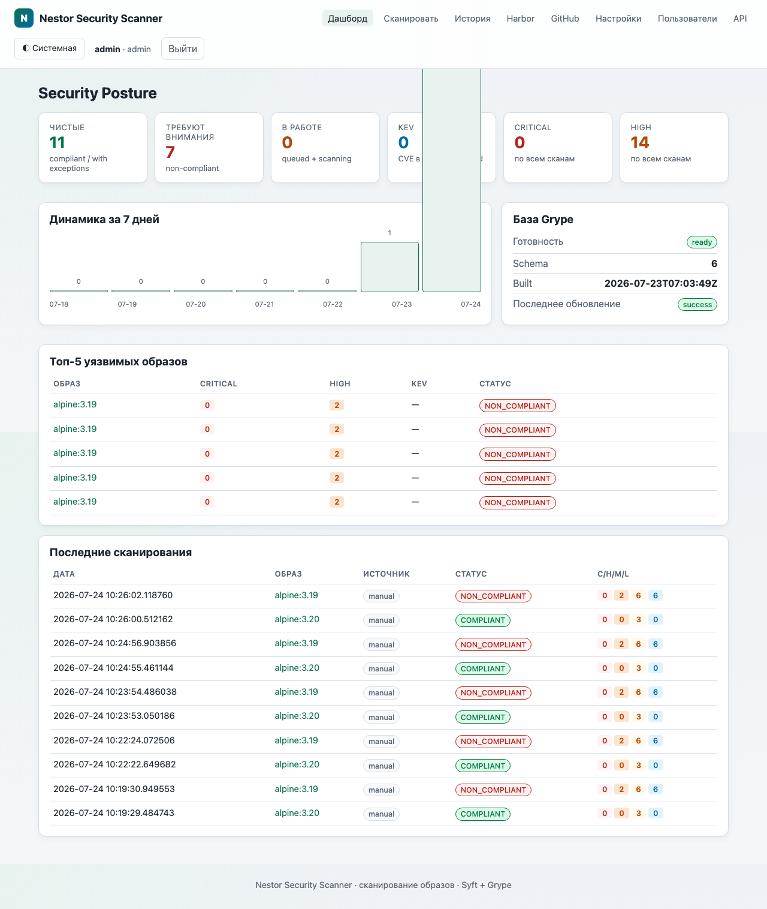

# Nestor Security Scanner

Локальный open-source инструмент **Nestor Security Scanner** для сканирования Docker/OCI-образов на уязвимости с помощью **Syft** (SBOM) и **Grype** (CVE), с веб-интерфейсом, очередью задач, интеграцией Harbor и политиками compliance.

Репозиторий: https://github.com/RsNest/NestorSecurityScan

## Возможности

- Ручное сканирование образа по имени или digest
- Интеграция с Harbor (проекты / репозитории / артефакты)
- Интеграция с GitHub Container Registry (ghcr.io) — владелец → пакет → теги → scan
- Webhook Harbor `PUSH_ARTIFACT` → фоновое сканирование (`202 Accepted`)
- Периодический discovery новых образов
- Авто-rescan всех сканов за последние N дней после обновления базы Grype
- Policy engine на YAML (severity, thresholds, KEV, EPSS, ignore)
- Отчёты: JSON, Syft SBOM, CycloneDX, Grype JSON, автономный HTML
- Rescan SBOM без повторной загрузки образа
- Аутентификация пользователей (admin/operator/viewer) + cookie-сессии + legacy X-API-Key для CI
- Светлая/тёмная тема (auto-scheme + ручной тоггл)
- Дашборд Security Posture: KEV, Critical/High, динамика за 7 дней, топ-5 уязвимых
- SQLite + файловые отчёты в Docker volume

## Архитектура

```text
Browser → FastAPI / Jinja2+HTMX → Redis (RQ) → Worker (Syft → Grype → Policy → Reports)
                                      ↑
                                 Scheduler (discovery, grype db update, retention)
```

Сервисы Compose: `api`, `worker`, `scheduler`, `redis`. Опционально `demo-registry` (profile `demo`).

## Требования

- Docker и Docker Compose
- Для локальных тестов Python 3.12+

## Быстрый старт

```bash
git clone https://github.com/RsNest/NestorSecurityScan.git
cd NestorSecurityScan
cp .env.example .env
docker compose up -d --build
```

Откройте http://localhost:8080 — вы увидите экран входа.

**Учётные данные по умолчанию:** `admin` / `admin` (смените после первого входа в разделе «Пользователи»). Задаются через `ADMIN_USER` / `ADMIN_PASSWORD` в `.env`. Если в БД уже есть пользователи — bootstrap не срабатывает.

Пример скана:

```bash
make scan IMAGE=alpine:3.20
```

или через UI: **Сканировать** → `alpine:3.20` → Scan.

## Переменные окружения

| Переменная | Описание |
|---|---|
| `WEB_PORT` | Порт веб-UI (по умолчанию 8080) |
| `ADMIN_USER` / `ADMIN_PASSWORD` | Bootstrap-администратор (только если таблица users пуста) |
| `SESSION_SECRET` | Секрет для подписи cookie-сессий (≥ 32 символов) |
| `API_KEY` | Legacy-ключ для мутирующих API (`X-API-Key`). Пустой = без ключа (но требуется сессия) |
| `GITHUB_TOKEN` | PAT с правами `read:packages` для страницы GitHub |
| `RESCAN_AFTER_DB_UPDATE` | Авто-rescan сканов после обновления Grype DB (по умолчанию true) |
| `RESCAN_RECENT_DAYS` | За сколько последних дней ресканить (по умолчанию 30) |
| `DATABASE_URL` | SQLite URL |
| `REDIS_URL` | Redis для очереди RQ |
| `MAX_CONCURRENT_SCANS` | Ориентир параллелизма (масштабируйте `worker`) |
| `SCAN_TIMEOUT_MINUTES` | Таймаут Syft/Grype |
| `POLICY_FILE` | Путь к YAML-политике |
| `HARBOR_*` | URL, credentials, TLS, фильтр проектов, webhook secret |
| `DISCOVERY_ENABLED` / `DISCOVERY_INTERVAL_MINUTES` | Периодический поиск новых образов |
| `GRYPE_DB_CACHE_DIR` | Кэш БД Grype |
| `GRYPE_DB_UPDATE_INTERVAL_HOURS` | Интервал авто-обновления БД |
| `REPORT_RETENTION_DAYS` | Срок хранения отчётов |

При старте API, если `API_KEY` пуст, в лог пишется предупреждение:
`API_KEY не задан — мутирующие эндпоинты не защищены`.

## Ручное сканирование

UI `/scans/new` или:

```bash
curl -X POST http://localhost:8080/api/v1/scans \
  -H 'Content-Type: application/json' \
  -d '{"image":"alpine:3.20"}'
```

## Harbor

Локальную smoke-проверку end-to-end (поднять Harbor + scanner + webhook + push образа) см. в [docs/integrations/harbor.md](docs/integrations/harbor.md).

1. Создайте Robot Account с минимальными правами:
   - pull repository
   - list repository
   - read artifact
   - list artifact  
   (push/delete не нужны)
2. Пропишите в `.env`:

```env
HARBOR_ENABLED=true
HARBOR_URL=https://harbor.example.ru
HARBOR_USERNAME=robot$project+scanner
HARBOR_PASSWORD=...
HARBOR_VERIFY_TLS=true
HARBOR_PROJECTS=project1,project2
HARBOR_WEBHOOK_SECRET=change-me
```

3. Перезапустите Compose и откройте `/harbor`.

### Webhook

В Harbor: Webhooks → событие **PUSH_ARTIFACT** → URL:

```text
https://<scanner-host>/api/v1/webhooks/harbor?secret=<HARBOR_WEBHOOK_SECRET>
```

или заголовок `X-Harbor-Auth` / `Authorization: Bearer <secret>`.

Endpoint сразу возвращает `202` и ставит задачу в очередь.

### Массовое сканирование и discovery

- В UI Harbor отметьте артефакты и нажмите «Сканировать выбранные».
- Включите `DISCOVERY_ENABLED=true` для периодического поиска новых digest.

## Политики

Файл монтируется в `/policies/default.yaml`. Пример ignore:

```yaml
ignore:
  - vulnerability: CVE-2025-12345
    package: openssl
    reason: Not reachable in runtime
    approved_by: security-team
    expires_at: 2026-12-31
```

Истёкшие исключения не применяются, но отображаются в отчёте.

## Приватный CA

Положите CA в `./certs/` (монтируется в worker как `/certs:ro`). При необходимости настройте системный trust или переменные TLS для инструментов.

## Формат отчётов

`/data/reports/<scan-id>/`:

- `metadata.json`
- `sbom.syft.json`
- `sbom.cyclonedx.json`
- `grype.json`
- `normalized-report.json`
- `report.html`
- `scan.log`

## Rescan

Кнопка **Rescan with current vulnerability database** запускает Grype по существующему SBOM без Syft. Rescan **обходит** дедуп активных задач.

## Grype DB

При **первом** запуске (или после `docker compose down -v`) worker выполняет **bootstrap**:
`ensure_grype_db()` до приёма задач из очереди. Первая загрузка БД может занять несколько минут (~1 GB).

- `/api/v1/health` возвращает `status: db_not_ready` и `grype_db: updating|not_ready|error|ready`
- Worker healthcheck становится healthy только после готовности БД (`start_period` до 10 минут)
- На Dashboard / Settings / форме скана показывается баннер о первичной загрузке
- При недоступности `grype.anchore.io` ошибка явно указывает на необходимость сети

```bash
make update-db
make db-status
```

Scheduler обновляет БД по `GRYPE_DB_UPDATE_INTERVAL_HOURS`. Повторные сбои обновления **не блокируют** сканы, если локальная БД уже есть; в UI помечается «устарела».

Версии в образе: **Syft 1.48.0**, **Grype 0.116.0**.

## Demo registry

```bash
make demo
# registry: localhost:5001
docker pull alpine:3.20
docker tag alpine:3.20 localhost:5001/demo/alpine:3.20
docker push localhost:5001/demo/alpine:3.20
```

Production-сценарий предполагает подключение к существующему Harbor, а не demo registry.

## Резервное копирование

Сохраняйте Docker volume `scanner-data` (`/data`: SQLite, reports, grype-db).

```bash
docker run --rm -v nestorsecurityscan_scanner-data:/data -v "$PWD":/backup alpine \
  tar czf /backup/scanner-data-backup.tgz -C /data .
```

## Makefile

```bash
make up | down | build | logs | restart | test | lint | format | clean
make update-db | db-status
make scan IMAGE=alpine:3.20
make demo
```

## API

OpenAPI: http://localhost:8080/docs

Основные endpoints: `/api/v1/health`, `/api/v1/scans`, `/api/v1/harbor/*`, `/api/v1/webhooks/harbor`, `/api/v1/auth/*`, `/api/v1/github/*`.

Авторизация:

- **Cookie-сессия** `nss_session` — для UI и рекомендуемый способ для большинства интеграций
- **Legacy `X-API-Key`** — для CI/скриптов, эквивалентен роли `operator`. Если `API_KEY` пуст — ключ не принимается, и мутирующие эндпоинты можно дёргать только с валидной сессией

Health и webhook — **без** авторизации.

## Веб-панель

После входа (`admin` / `admin` по умолчанию) открывается **Дашборд** — единая точка обзора безопасности образов.



### Страницы

| Страница | URL | Что делает | Кто видит |
|---|---|---|---|
| **Дашборд** | `/` | Security posture: compliant/non-compliant, running scans, KEV, Critical/High, динамика за 7 дней, топ-5 уязвимых образов, статус Grype DB | все роли |
| **Сканировать** | `/scans/new` | Форма запуска скана: имя образа или `repo@digest`, policy, source (`manual`/`harbor`/`github`/`rescan`) | `operator`, `admin` |
| **История** | `/scans` | Таблица всех сканов, фильтры по статусу / источнику, пагинация | все роли |
| **Детали скана** | `/scans/{id}` | SBOM, найденные CVE, политика, статус compliance, кнопки Rescan / Cancel / Delete, скачивание отчётов | все роли (Rescan/Cancel — `operator`+; Delete — `admin`) |
| **Harbor** | `/harbor` | Список проектов → репозиториев → артефактов. Чекбоксы → «Сканировать выбранные». Фильтр severity | `operator`, `admin` |
| **GitHub** | `/github` | Выбор owner → пакетов → тегов → scan (через `GITHUB_TOKEN`) | `operator`, `admin` |
| **Настройки** | `/settings` | Конфигурация Harbor, GitHub, Auto-rescan, учётная запись, статус Grype DB | все роли (свои) |
| **Пользователи** | `/users` | CRUD локальных пользователей, смена ролей, активация/деактивация | **только admin** |
| **API** | `/docs` | Swagger UI (OpenAPI) | все роли |
| **Войти** | `/login` | Анонимный экран входа. Шапка и навигация **скрыты** до авторизации | анонимный |

### Роли

| Роль | Что может | Что не может |
|---|---|---|
| `admin` | Всё: сканирование, удаление, управление пользователями, настройки | — |
| `operator` | Сканирование, Rescan, Cancel, чтение всего | Удаление, управление пользователями |
| `viewer` | Только чтение (дашборд, история, детали, отчёты) | Любые мутации |

RBAC на уровне **и API, и web-роутов**. Недостаточно прав → `403` с понятной страницей «Недостаточно прав» и кнопкой «На дашборд».

### Тема оформления

Три режима: **Светлая** ☀, **Тёмная** ☾, **Системная** ◐ (следует `prefers-color-scheme`).

- Тема применяется **до** первого рендера через inline-скрипт в `<head>` — нет Flash Of Unstyled Content
- Выбор сохраняется в cookie `nss_theme`, доступен с любой страницы
- Тоггл в правом верхнем углу — цикл по 3 состояниям

### Авторизация и сессии

- Логин по форме (`/login`) или `POST /api/v1/auth/login` (`{"username","password"}`)
- Cookie `nss_session` — HttpOnly, SameSite=Lax, время жизни `SESSION_MAX_AGE_SECONDS` (по умолчанию 12 ч)
- `POST /api/v1/auth/logout` — выход
- `GET /api/v1/auth/me` — текущий пользователь
- Legacy `X-API-Key` — для CI/скриптов, эквивалентен роли `operator`

Bootstrap-администратор (`ADMIN_USER` / `ADMIN_PASSWORD`) создаётся **только если в БД нет ни одного пользователя**. В проде смените пароль сразу после первого входа.

### Авто-обновление базы уязвимостей

Scheduler обновляет Grype DB каждые `GRYPE_DB_UPDATE_INTERVAL_HOURS` (по умолчанию 24). При успешном обновлении автоматически ставит в очередь **rescan всех сканов за последние `RESCAN_RECENT_DAYS` дней** — чтобы новые CVE нашли существующие образы без ручного запуска. Уведомления пишутся в лог (расширяемая `Notifier`-инфраструктура для Slack/Email и т.д.).

## Ограничения v1

- Полная интеграция registry: Harbor + ручной image reference
- KEV/EPSS только из полей Grype JSON (отдельных фидов CISA/FIRST нет)
- UI не для публичного доступа без reverse-proxy / SSO
- Отмена running — best-effort
- Harbor credentials только из `.env`

## Troubleshooting

| Симптом | Что проверить |
|---|---|
| 401 от registry | Robot account, права Pull |
| TLS verify failed | CA в `/certs` или `HARBOR_VERIFY_TLS` |
| Image not found | Имя/тег/digest |
| Syft/Grype timeout | `SCAN_TIMEOUT_MINUTES`, сеть к registry |
| База Grype | `make update-db`, место на диске |
| Policy YAML | синтаксис файла `/policies` |
| Webhook ignored | secret, тип события `PUSH_ARTIFACT` |

## Безопасность

См. [SECURITY.md](SECURITY.md). Docker socket не монтируется, privileged не используется, контейнеры — non-root, `cap_drop: ALL`.

## Лицензия

Apache-2.0 — см. [LICENSE](LICENSE).
